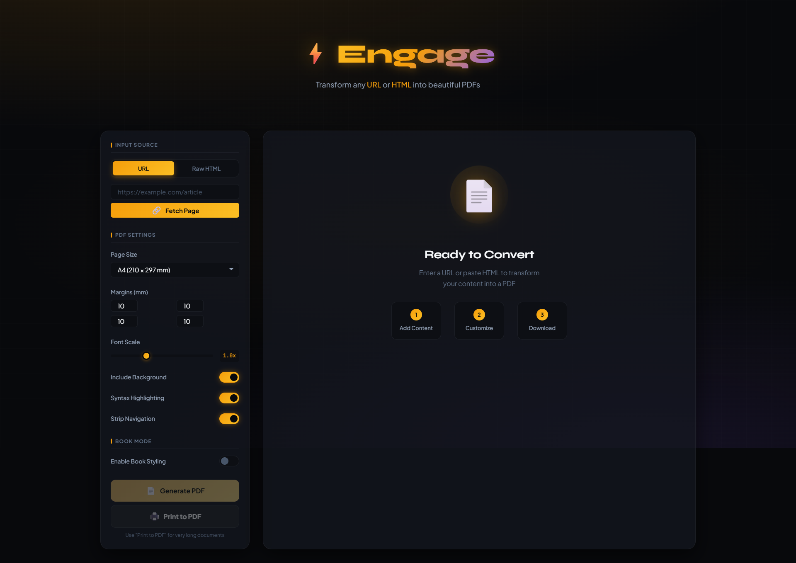

<div align="center">
  
  <h1>Engage - URL to PDF Converter</h1>
  <p>A beautiful, lightweight web application that converts URLs and raw HTML to customizable, publication-quality PDFs with client-side generation and optional AI-powered content cleanup.</p>
</div>

[](https://opensource.org/licenses/MIT)
[](https://github.com/nilayk/engage/actions/workflows/docker-publish.yml)

> **Note**: This project was generated with the assistance of Claude (Anthropic), an AI language model. The code has been reviewed but may contain imperfections. Contributions and improvements are welcome!

## Features

### Core Features
- **URL Conversion**: Fetch any webpage and convert it to PDF
- **Raw HTML Support**: Paste HTML directly for conversion
- **Print to PDF**: Browser-native printing for very long documents

### PDF Customization
- **Page Sizes**: A4, Letter, Legal, Tabloid, Kindle, Smartphone, Custom
- **Margins**: Adjustable margins on all sides
- **Font Scaling**: Scale text for readability
- **Syntax Highlighting**: Code blocks with highlight.js
- **Strip Navigation**: Remove headers, footers, nav, ads
- **Background Control**: Include/exclude backgrounds

### Book Mode
Transform web content into beautiful, publication-ready PDFs:

- **Table of Contents**: Auto-generated from headings
- **Drop Caps**: Elegant first-letter styling
- **Chapter Headers**: Decorative chapter formatting
- **Book Fonts**: Georgia, Merriweather, Libre Baskerville, Literata
- **Typography Cleanup**: Smart quotes, em-dashes, justified text

### AI Features (Optional)
Integrated [Ollama](https://ollama.ai/) for intelligent content processing:

**Smart Extraction** (Embeddings-based):
- Uses `nomic-embed-text` to semantically identify main content
- Automatically filters out navigation, sidebars, and boilerplate
- Works better than CSS selectors for complex pages

**AI Cleanup** (LLM-based):
- Uses `qwen2.5-coder` to clean up formatting
- Fixes heading hierarchy
- Removes remaining non-content elements

---

## Screenshots

<div align="center">
  
  
  <p><em>Main interface with URL input and PDF customization options</em></p>
  
</div>

---

## Quick Start with Docker

### Prerequisites

Install [Docker Desktop](https://www.docker.com/products/docker-desktop/) (includes Docker Compose V2).

Verify installation:
```bash
docker --version
docker compose version
```

### Option 1: Full Setup (with AI)

Includes Ollama for AI-powered content extraction and cleanup.

```bash
# Download files
curl -O https://raw.githubusercontent.com/nilayk/engage/main/docker-compose.yml
curl -O https://raw.githubusercontent.com/nilayk/engage/main/docker-compose.gpu.yml
curl -O https://raw.githubusercontent.com/nilayk/engage/main/start.sh
chmod +x start.sh

# (Optional) Create .env file to customize settings
curl -O https://raw.githubusercontent.com/nilayk/engage/main/.env.example
cp .env.example .env

# Start with auto GPU detection
./start.sh

# Wait for models to download (first run only)
./start.sh logs

# Open http://localhost:3000
```

The startup script automatically detects NVIDIA GPUs and enables acceleration if available.

#### Windows (PowerShell)

```powershell
# Download files
Invoke-WebRequest -Uri "https://raw.githubusercontent.com/nilayk/engage/main/docker-compose.yml" -OutFile "docker-compose.yml"
Invoke-WebRequest -Uri "https://raw.githubusercontent.com/nilayk/engage/main/docker-compose.gpu.yml" -OutFile "docker-compose.gpu.yml"
Invoke-WebRequest -Uri "https://raw.githubusercontent.com/nilayk/engage/main/start.ps1" -OutFile "start.ps1"

# Start with auto GPU detection
.\start.ps1

# Open http://localhost:3000
```

#### Manual GPU Control

If you prefer manual control over GPU usage:

```bash
# CPU only
docker compose up -d

# With GPU (manual)
docker compose -f docker-compose.yml -f docker-compose.gpu.yml up -d
```

**Prerequisites for GPU support:**
- NVIDIA GPU with compute capability 5.0+
- NVIDIA drivers installed (`nvidia-smi` should work)
- **Linux**: [nvidia-container-toolkit](https://docs.nvidia.com/datacenter/cloud-native/container-toolkit/install-guide.html) installed
- **Windows**: Docker Desktop with WSL2 backend + [NVIDIA GPU drivers for WSL](https://developer.nvidia.com/cuda/wsl)

**Services started:**
| Container | Description | Port |
|-----------|-------------|------|
| `engage` | Web application | 3000 |
| `engage-ollama` | Ollama AI server | 11434 |
| `engage-ollama-setup` | Downloads AI models (exits after) | - |

### Option 2: Lite Setup (no AI)

Lightweight version without AI features (~100MB).

```bash
# Download docker-compose.lite.yml
curl -O https://raw.githubusercontent.com/nilayk/engage/main/docker-compose.lite.yml

# Start
docker compose -f docker-compose.lite.yml up -d

# Open http://localhost:3000
```

---

## Docker Commands

### Using Startup Scripts (Recommended)

The startup scripts auto-detect NVIDIA GPUs and enable acceleration automatically.

**Linux/macOS:**
```bash
./start.sh              # Start (auto GPU detection)
./start.sh down         # Stop
./start.sh logs         # View logs
./start.sh status       # Check status
./start.sh restart      # Restart
```

**Windows PowerShell:**
```powershell
.\start.ps1             # Start (auto GPU detection)
.\start.ps1 down        # Stop
.\start.ps1 logs        # View logs
.\start.ps1 status      # Check status
.\start.ps1 restart     # Restart
```

### Using Docker Compose Directly

```bash
# Start services (CPU only)
docker compose up -d

# Start with GPU
docker compose -f docker-compose.yml -f docker-compose.gpu.yml up -d

# View status
docker compose ps

# View logs
docker compose logs -f              # All services
docker compose logs -f engage       # Just web app
docker compose logs -f ollama       # Just Ollama

# Stop services (keeps data)
docker compose stop

# Start again
docker compose start

# Stop and remove containers
docker compose down

# Stop and remove everything (including AI models)
docker compose down -v

# Rebuild after code changes
docker compose up -d --build
```

### Lite version commands
```bash
docker compose -f docker-compose.lite.yml up -d
docker compose -f docker-compose.lite.yml down
```

---

## Building a Standalone Image

Build a self-contained image that can be deployed anywhere:

```bash
# Build the image
docker build -t engage:latest .

# Run standalone (no AI)
docker run -d -p 3000:3000 --name engage engage:latest

# Run with external Ollama
docker run -d -p 3000:3000 \
  -e OLLAMA_HOST=http://your-ollama-server:11434 \
  --name engage engage:latest
```

---

## Local Development

### Prerequisites
- Node.js 18+ ([Download](https://nodejs.org/))

### Setup

```bash
# Clone repository
git clone https://github.com/nilayk/engage.git
cd engage

# Install dependencies
npm install

# Start server
npm start

# Open http://localhost:3000
```

### With Local Ollama

```bash
# Install Ollama from https://ollama.ai/
ollama pull qwen2.5-coder:1.5b
ollama pull nomic-embed-text

# Start Engage (connects to localhost:11434 automatically)
npm start
```

---

## Configuration

### Using .env File (Recommended for Docker)

Create a `.env` file in the same directory as your `docker-compose.yml`:

```bash
# Download the example configuration
curl -O https://raw.githubusercontent.com/nilayk/engage/main/.env.example
cp .env.example .env

# Edit .env to customize
```

Example `.env` file:
```env
# Server
PORT=3000

# AI Models
OLLAMA_MODEL=qwen2.5-coder:1.5b
EMBEDDING_MODEL=nomic-embed-text

# Timeouts (increase for slower hardware)
OLLAMA_GENERATE_TIMEOUT=180000
```

The models specified in `.env` are automatically downloaded when you run `docker compose up -d`.

### Environment Variables

| Variable | Default | Description |
|----------|---------|-------------|
| `PORT` | 3000 | Server port |
| `OLLAMA_HOST` | http://localhost:11434 | Ollama API endpoint |
| `OLLAMA_MODEL` | qwen2.5-coder:1.5b | LLM for AI cleanup |
| `EMBEDDING_MODEL` | nomic-embed-text | Model for smart extraction |
| `OLLAMA_GENERATE_TIMEOUT` | 180000 | AI generation timeout in ms (3 min default) |

### Custom Port

```bash
# Docker
docker run -d -p 8080:3000 engage:latest

# Local
PORT=8080 npm start
```

### AI Model Alternatives

| Model | Size | RAM | Best For |
|-------|------|-----|----------|
| `qwen2.5-coder:1.5b` | ~1GB | 4GB | Default - fast, efficient |
| `qwen2.5-coder:3b` | ~2GB | 6GB | Better quality |
| `phi3:mini` | ~2GB | 6GB | Good instruction following |

---

## Architecture

```
┌─────────────────────────────────────────────────┐
│              Docker Compose Network              │
│                                                  │
│  ┌──────────────┐       ┌──────────────────┐    │
│  │    Engage    │◄─────►│     Ollama       │    │
│  │   (Node.js)  │ HTTP  │  qwen2.5-coder   │    │
│  │    :3000     │       │  nomic-embed     │    │
│  └──────────────┘       └──────────────────┘    │
│         │                       │               │
└─────────┼───────────────────────┼───────────────┘
          │                       │
     Port 3000              Port 11434
     (Web UI)            (Ollama API)
```

---

## Usage Tips

| Scenario | Recommendation |
|----------|----------------|
| Long documents (20+ pages) | Use "Print to PDF" button |
| Articles, guides, docs | Enable Book Mode |
| E-readers, phones | Use Kindle/Smartphone size, increase font |
| Messy web pages | Enable Smart Extraction + AI Cleanup |

---

## System Requirements

### Lite Version (no AI)
- RAM: 256MB
- Storage: ~100MB

### Full Version (with AI - CPU)
- RAM: 4GB recommended (8GB for larger models)
- Storage: ~2.5GB (models)

### Full Version (with AI - GPU)
- NVIDIA GPU with 4GB+ VRAM
- NVIDIA drivers + container toolkit
- RAM: 4GB system RAM
- Storage: ~2.5GB (models)

---

## Troubleshooting

### "Cannot connect to Docker daemon"
- Ensure Docker Desktop is running

### "Port 3000 already in use"
```bash
# Find what's using it
# Windows: netstat -ano | findstr :3000
# Linux/Mac: lsof -i :3000

# Or use a different port
docker compose up -d -e PORT=8080
```

### "AI features not working"
```bash
# Check Ollama is running
docker compose logs ollama

# Check models were downloaded
docker compose logs ollama-setup

# Verify API is accessible
curl http://localhost:11434/api/tags
```

### "Ollama cleanup error: Request timeout"

The AI model is taking too long to process content. This often happens on:
- First request (model cold-start/loading into memory)
- Large pages with lots of content
- Systems with limited CPU/RAM

**Solution**: Increase the timeout in your `.env` file:
```env
# Increase to 5 minutes (300000ms) or more
OLLAMA_GENERATE_TIMEOUT=300000
```

Then restart:
```bash
docker compose down
docker compose up -d
```

### "GPU not being used by Ollama"

Ensure you're using the GPU compose file:
```bash
docker compose -f docker-compose.yml -f docker-compose.gpu.yml up -d
```

Verify GPU is accessible:
```bash
# Check NVIDIA drivers on host
nvidia-smi

# Check GPU is visible in container
docker exec engage-ollama nvidia-smi
```

**Linux**: Install [nvidia-container-toolkit](https://docs.nvidia.com/datacenter/cloud-native/container-toolkit/install-guide.html):
```bash
# Ubuntu/Debian
sudo apt-get install -y nvidia-container-toolkit
sudo nvidia-ctk runtime configure --runtime=docker
sudo systemctl restart docker
```

**Windows**: Ensure Docker Desktop is using WSL2 backend and you have [NVIDIA GPU drivers for WSL](https://developer.nvidia.com/cuda/wsl) installed.

---

## Contributing

Contributions welcome! See [CONTRIBUTING.md](CONTRIBUTING.md).

---

## Disclaimer

This project was created with assistance from **Claude** (Anthropic), a large language model. While tested and reviewed, it may contain imperfections. Use at your own discretion and review code before production deployment.

---

## License

[MIT License](LICENSE) - Copyright (c) 2025 Engage Contributors

---

## Acknowledgments

- [html2pdf.js](https://github.com/eKoopmans/html2pdf.js) - PDF generation
- [Ollama](https://ollama.ai/) - Local AI
- [highlight.js](https://highlightjs.org/) - Syntax highlighting
- [DOMPurify](https://github.com/cure53/DOMPurify) - HTML sanitization
